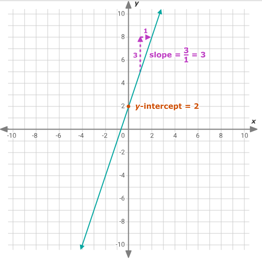

# guess-it-2

## Program

Given a number as standard input, this program prints out a range in which the next number provided should be.

The data received by the program (via the tester), is presented as the following example:
```bash
    189
    123
    121
    114
    145
    110
    ...
```

This data represents a graph in which the values of the x axis are the number of the lines (0, 1, 2, 3, 4, 5 ...) and the values of the y axis are the actual numbers (189, 113, 121, 114, 145, 110...).

Each of the numbers will be your standard input and the purpose of your program is for you to find the range in which the next number will be in. This range should have a space separating the lower limit from the upper one like in the example:
```bash
189    --> Standard input
<120 132>    --> The guessed range
next value: 123    --> The range was correct
```

## Algorithm

To guess a correct and small range for a next value, I used **regression line +/- 6**.

<div style="display: flex; height: 500px;">
    
    
</div>

## Usage & Testing

Make sure to install the used NumPy Library:

```
pip install numpy
```

To test the program, make sure that **student** folder is inside the [tester](https://assets.01-edu.org/guess-it/guess-it-dockerized.zip) extracted file.

Make the [script](./script.sh) inside the student folder executable:

```bash
cd student && chmod +x script.sh && cd ..
```

To run program, these commands should be ran to have the
dependencies needed and to start the webpage on the port 3000:


1. Using `node`:

```bash
npm install express
npm start
```

2. Using `docker compose`:

```bash
docker-compose up
```

To reload the server use:

```bash
docker-compose down -v && docker-compose up --build
```

2. Using `dockerfile`:

```bash
docker build -t guesser .
docker run -p 3000:3000 guesser
``` 

After opening your browser of preference in the port
[port 3000](http://localhost:3000/), if you try clicking on any of the `Test Data`
buttons, you will notice that in the Dev Tool/ Console there is a message which
tells you that you need another guesser besides the student.

Adding a guesser is simple. You need to add in the URL a guesser, in other
words, the name of one of the files present in the `ai/` folder:

```bash
localhost:3000?guesser=<name_of_guesser>
```

Choose from `big-range`, `linear-regr`, `correlation-coef`, `mse`, and `nic`. For example:

```bash
localhost:3000?guesser=big-range
```

Note that for this project, only data set `4`, `5` are considered.

After that, choose which of the random data set to test. After that you can
wait for the program to test all of the values (boooooring), or you can click
`Quick` to skip the waiting and be presented with the results.

Since the website uses big data sets, we advise you to clear the displays
clicking on the `Clean` button after each test.